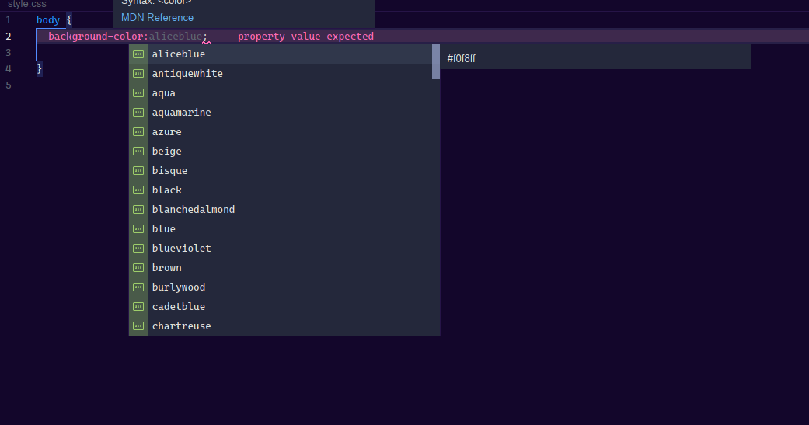
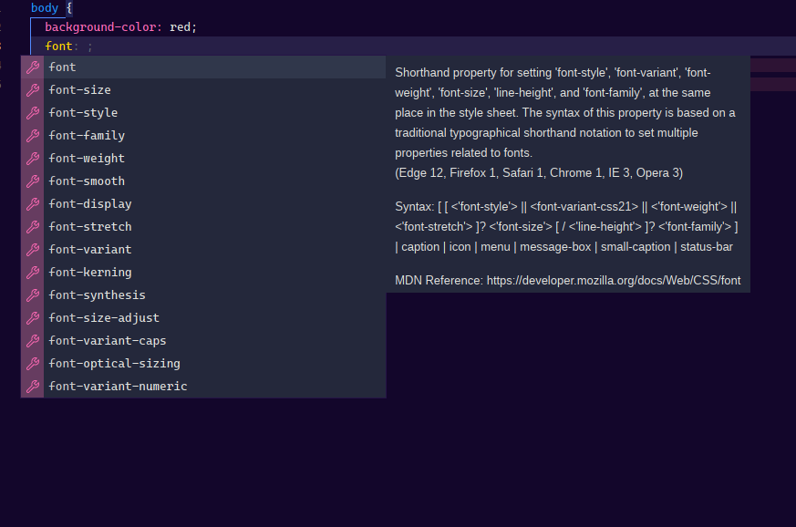
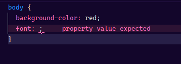

# Lapce plugin for css/scss

## Prerequisites

Install `vscode-langservers-extracted` via `npm` or your system package manager  
Server needs to be in one of the paths included in `PATH` environment variable

```
npm i -g vscode-langservers-extracted.
```

## Available configuration

```toml
[lapce-css.volt]
serverPath = "<custom executable>"
serverArgs = ["--stdio"] # --stdio is required for all LSPs written in nodejs
```
## In Action!

>

>

>
